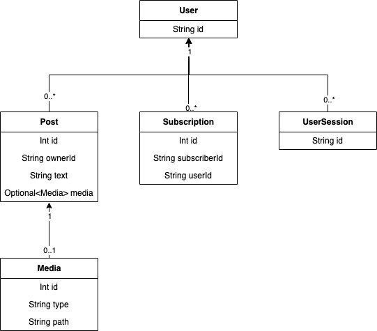

Twitter Project

Twitter is Social Media that lets authenticated users create and manage tweets with media and manage followers.

Enviroment variables needed:
AWS_ACCESS_KEY
AWS_SECRET_KEY
PROJECT_HOME
DB_URL
DB_PASSWORD
DB_USERNAME

Technologies used in this project:
Java
Spring Boot
MySQL
AWS EC2
AWS S3
AWS RDS
Keycloak
Flyway

Twitter has a custom API and DB schema implemented. DB is controlled by Flyway to quickly create new tables, schemas and columns and avoid accidental deletion of data. The project uses Keycloak to manage users' accounts data, roles and sessions. Also, this project runs on an AWS EC2 server, DB runs on AWS RDS, and users' files are located in AWS S3.

